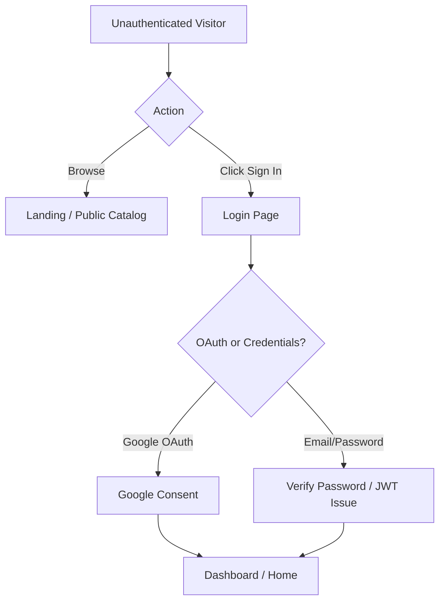
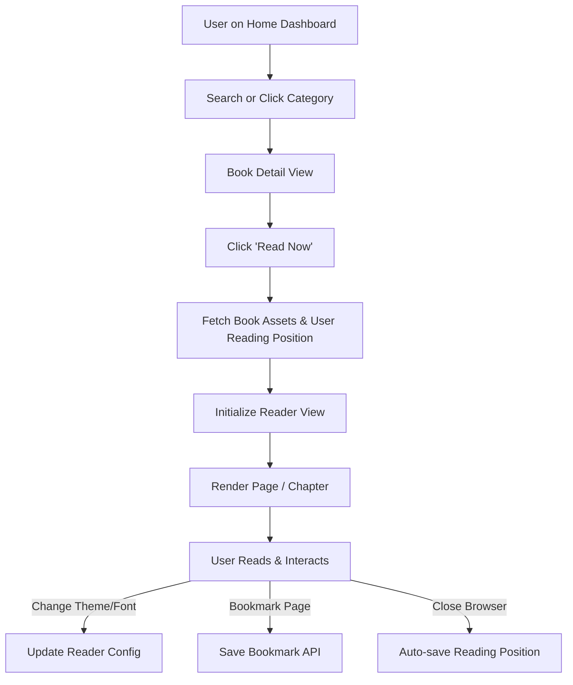

# User Flows

## 1. Authentication & Onboarding Flow

```mermaid
flowchart TD
    A[Unauthenticated Visitor] --> B{Action}
    B -->|Browse| C[Landing / Public Catalog]
    B -->|Click Sign In| D[Login Page]
    D --> E{OAuth or Credentials?}
    E -->|Google OAuth| F[Google Consent]
    E -->|Email/Password| G[Verify Password / JWT Issue]
    F --> H[Dashboard / Home]
    G --> H
```

---

## 2. Book Discovery to Reading Flow

```mermaid
flowchart TD
    A[User on Home Dashboard] --> B[Search or Click Category]
    B --> C[Book Detail View]
    C --> D[Click 'Read Now']
    D --> E[Fetch Book Assets & User Reading Position]
    E --> F[Initialize Reader View]
    F --> G[Render Page / Chapter]
    G --> H[User Reads & Interacts]
    H -->|Change Theme/Font| I[Update Reader Config]
    H -->|Bookmark Page| J[Save Bookmark API]
    H -->|Close Browser| K[Auto-save Reading Position]
```
