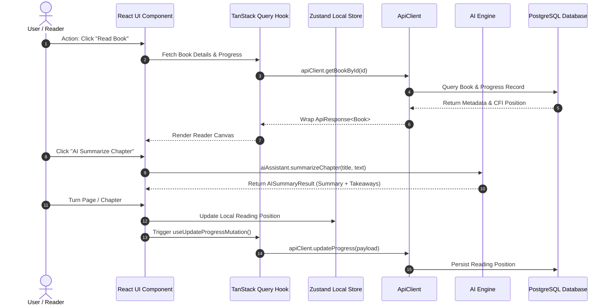

# Data Flow & Lifecycle Specifications

## 1. End-to-End Data Pipeline

```mermaid
sequenceDiagram
    autonumber
    actor Reader as User / Reader
    participant UI as React UI Component
    participant Hook as TanStack Query Hook
    participant Store as Zustand Local Store
    participant API as ApiClient
    participant AI as AI Engine
    participant DB as PostgreSQL Database

    Reader->>UI: Action: Click "Read Book"
    UI->>Hook: Fetch Book Details & Progress
    Hook->>API: apiClient.getBookById(id)
    API->>DB: Query Book & Progress Record
    DB-->>API: Return Metadata & CFI Position
    API-->>Hook: Wrap ApiResponse<Book>
    Hook-->>UI: Render Reader Canvas
    
    Reader->>UI: Click "AI Summarize Chapter"
    UI->>AI: aiAssistant.summarizeChapter(title, text)
    AI-->>UI: Return AISummaryResult (Summary + Takeaways)
    
    Reader->>UI: Turn Page / Chapter
    UI->>Store: Update Local Reading Position
    UI->>Hook: Trigger useUpdateProgressMutation()
    Hook->>API: apiClient.updateProgress(payload)
    API->>DB: Persist Reading Position
```
